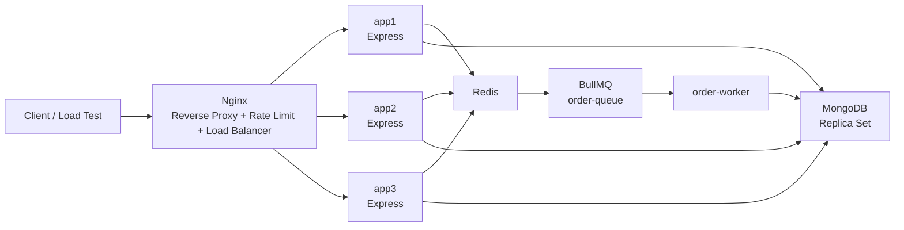
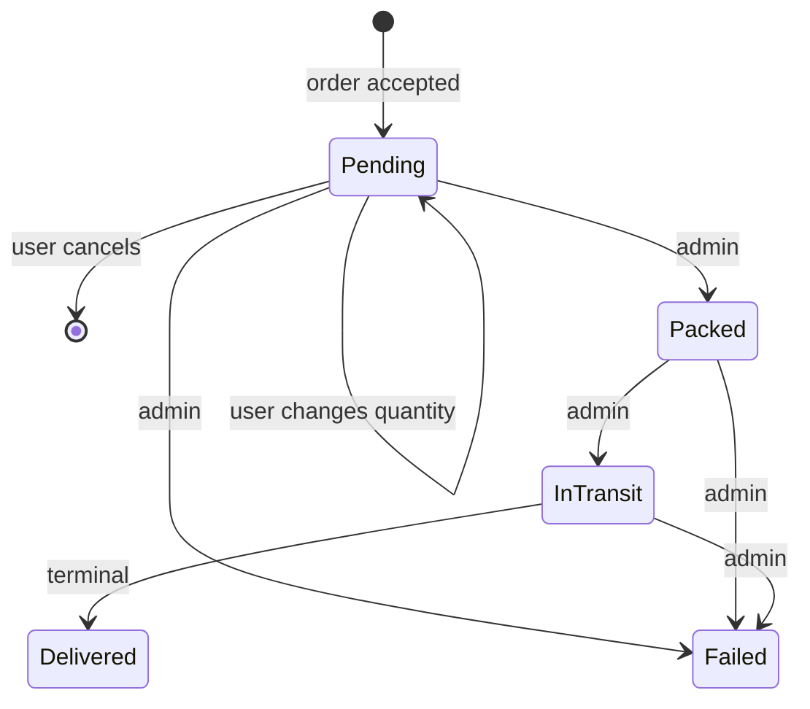

# MqLbRprl

## Message Queue · Load Balancer · Reverse Proxy · Rate Limiting

A local distributed-systems lab built around a small e-commerce backend.

The project is designed to make four infrastructure mechanisms observable under load:

- **MQ — Message Queue:** Redis + BullMQ buffer flash-sale order work.
- **LB — Load Balancing:** Nginx distributes HTTP traffic across three Node/Express replicas.
- **RP — Reverse Proxy:** Nginx is the only public HTTP entry point and forwards requests to the application replicas.
- **RL — Rate Limiting:** Nginx applies per-IP request limits and controlled bursts.

The same application deliberately uses **two different order-processing paths** so the effect of these mechanisms can be compared under different workloads.

> This repository is a **reproducible local lab**, not a claim that a single laptop is production-scale infrastructure. The measured numbers in this README are observations from one local Docker environment.

---

## What the project demonstrates

### 1. Normal sustained traffic

Normal orders remain synchronous:

```text
Client
  ↓
Nginx
  ↓
app1 / app2 / app3
  ↓
MongoDB transaction
  ↓
201 Created
```

The order request performs the inventory check, stock decrement, and order creation before the HTTP response is returned.

This path is intentionally useful for measuring how a request-path MongoDB workload behaves as request rate increases.

### 2. Flash-sale traffic

Flash-sale orders use an asynchronous admission path:

```text
Client
  ↓
Nginx
  ↓
app1 / app2 / app3
  ↓
Redis atomic reservation
  ↓
BullMQ / Redis
  ↓
order-worker
  ↓
MongoDB transaction
  ↓
Order persisted
```

The client receives:

```text
202 Accepted + jobId
```

and can later query:

```text
GET /api/v1/orders/jobs/:jobId
```

The important design decision is that **the HTTP connection does not remain open while the worker processes the order**.

---

# Architecture



### Network boundaries

| Component | Host access | Container access |
|---|---|---|
| Nginx | `localhost:8080` | `:80` |
| MongoDB | `127.0.0.1:27018` | `mongo:27017` |
| Redis | `127.0.0.1:6379` | `redis:6379` |
| app1/app2/app3 | not public | `:3000` |
| order-worker | not public | consumes BullMQ jobs |

The application replicas are intentionally not exposed directly to the host. Clients use the Nginx entry point.

---

# Why the name `MqLbRprl`

| Pillar | Meaning | Implementation |
|---|---|---|
| **MQ** | Message Queue | Redis + BullMQ `order-queue` + `order-worker` |
| **LB** | Load Balancing | Nginx upstream with `app1`, `app2`, `app3` |
| **RP** | Reverse Proxy | Nginx forwards client requests to the Node replicas |
| **RL** | Rate Limiting | Nginx `limit_req` zones |

There is also an older `load-balancer.js` in the repository. It is an earlier learning implementation and is **not used by the Docker stack**. Nginx is the active load balancer.

---

# Core design: two order paths

## Normal order path

When a product is not in a flash sale:

```text
POST /api/v1/orders
        ↓
    Nginx
        ↓
  Express replica
        ↓
  placeOrder()
        ↓
MongoDB transaction
   ├─ verify product
   ├─ conditionally decrement stock
   └─ insert order
        ↓
    201 Created
```

The inventory update is protected by an atomic stock condition:

```text
quantity >= requestedQuantity
```

followed by an atomic decrement.

The product update and order creation are performed in the same MongoDB transaction.

### What the queue is NOT doing here

Normal orders are not forced through BullMQ.

That is deliberate. The project compares:

- synchronous request-path persistence for normal traffic
- asynchronous queued persistence for flash-sale traffic

---

# Flash-sale order path

When a product is in flash-sale mode:

```text
POST /api/v1/orders
        ↓
    Nginx
        ↓
  Express replica
        ↓
Redis Lua reservation
   ├─ reserve → continue
   └─ insufficient → 400
        ↓
BullMQ job
        ↓
202 Accepted + jobId
        ↓
order-worker
        ↓
same MongoDB order transaction
        ↓
Redis reservation → COMPLETED
```

The client can then poll:

```text
GET /api/v1/orders/jobs/:jobId
```

and observe:

```text
PENDING
PROCESSING
COMPLETED
FAILED
```

The completed response can include:

- queue wait time
- worker processing time
- total job lifetime
- created order ID

---

# Inventory correctness

One of the main goals of the lab is to verify that sudden load does **not create more orders than available stock**.

## Normal orders

MongoDB protects the durable inventory using an atomic conditional update inside the transaction.

## Flash-sale orders

Redis performs the fast admission decision.

The reservation is performed by a Lua script so the check and decrement happen atomically:

```text
read available stock
        ↓
check stock >= requested quantity
        ↓
decrement stock
        ↓
write reservation record
```

Only requests that successfully reserve inventory become BullMQ jobs.

This is why the queue does not itself prevent overselling.

> **Overselling prevention comes from atomic inventory control.**
>
> **BullMQ provides buffering and controlled asynchronous processing.**

The flash-sale design intentionally allows Redis reservation state and MongoDB durable stock to be temporarily different while jobs are waiting in the queue. Once the jobs finish successfully, MongoDB and the Redis reservation accounting are reconciled before the flash sale is ended.

---

# Idempotency

Flash-sale requests require an:

```http
Idempotency-Key: <unique-key>
```

A deterministic reservation ID is derived from the authenticated user and idempotency key.

This gives repeated submissions of the same logical request a stable identity.

The order model also stores an idempotency key with a unique sparse index.

This is important because BullMQ jobs may be retried after transient worker/database failures.

---

# Failure handling

The queue is configured with retries and exponential backoff:

```text
attempts: 3
backoff: exponential
```

The worker:

1. receives a job
2. runs the normal MongoDB order transaction
3. marks the Redis reservation as completed
4. returns the created order ID

For a final worker failure, the implementation attempts to release an unresolved Redis reservation so the reserved unit is not permanently trapped.

The flash-sale lifecycle also prevents ending a sale while product-specific jobs are still waiting or active, and checks Redis/Mongo inventory consistency before deactivation.

---

# Nginx

Nginx is the public entry point:

```text
http://localhost:8080
```

It currently provides:

- reverse proxying
- load balancing
- request rate limiting
- upstream failure handling
- request forwarding headers
- connection capacity for large local bursts

The active configuration uses:

```nginx
worker_processes auto;

events {
    worker_connections 8192;
}
```

and the Docker Compose service allows a high open-file limit.

## Current request limits

These are server-side Nginx settings, not benchmark settings.

| Route | Rate | Burst | Purpose |
|---|---:|---:|---|
| Exact `/api/v1/orders` location | `1000 r/s` | `1000` | high-volume order admission experiments |
| `/api/v1/orders/jobs/...` | `100 r/s` | `200` | controlled job-status polling |
| `/api/v1/auth/...` | `2 r/s` | `5` | protect authentication endpoints |
| Other `/api/...` routes | `20 r/s` | `50` | protect normal API traffic |

All limits are keyed by client IP.

Because the load generator runs from one laptop, all benchmark requests share the same IP bucket.

> The exact Nginx location for `/api/v1/orders` is path-based. The benchmark workload uses `POST /api/v1/orders`.

---

# Load balancing

The active Nginx upstream contains:

```text
app1:3000
app2:3000
app3:3000
```

Every application response exposes:

```http
X-INSTANCE-ID
```

so load distribution can be observed directly.

For example:

```text
server-1
server-2
server-3
```

The upstream uses passive failure handling through `max_fails` and `fail_timeout`.

Docker health checks also gate application startup and Nginx dependency startup.

This is intentionally a local demonstration of replica routing, not a claim of a full service-discovery or active-health-check production platform.

---

# Redis

Redis is used for flash-sale admission state.

Per-product flash-sale state includes:

```text
flash-sale:active:<productId>
flash-sale:stock:<productId>
flash-sale:reservation:<reservationId>
```

Redis is therefore a fast temporary admission layer.

MongoDB remains the durable source of truth for persisted product and order records.

Redis is **not** used to mirror every normal product quantity update.

Flash-sale stock is initialized when the flash sale starts.

---

# BullMQ

BullMQ provides the asynchronous `order-queue`.

Default job behaviour includes:

- 3 attempts
- exponential backoff
- automatic cleanup of old completed jobs
- automatic cleanup of old failed jobs

The benchmark client does not add jobs directly.

The normal path is:

```text
HTTP request
    ↓
orderController
    ↓
orderQueue.add(...)
```

The worker is the separate consumer:

```text
order-worker
    ↓
BullMQ Worker("order-queue")
```

Multiple worker processes can consume from the same shared queue.

---

# MongoDB

The Docker environment uses a local MongoDB replica set because the order service uses transactions.

The local database is:

```text
mqlbrprl
```

The container connection uses:

```text
mongodb://mongo:27017/mqlbrprl?replicaSet=rs0
```

The host-side mapped MongoDB port is:

```text
127.0.0.1:27018
```

The local benchmark environment keeps load-test writes away from Atlas.

---

# Project structure

```text
MqLbRprl/
│
├── config/
│   └── redis.js
│
├── controllers/
│   ├── authController.js
│   ├── orderController.js
│   └── productController.js
│
├── db/
│   └── connectDb.js
│
├── error_handlers/
│   ├── BadRequestError.js
│   ├── CustomApiError.js
│   ├── ForbiddenError.js
│   ├── NotFoundError.js
│   ├── ServiceUnavailableError.js
│   └── UnAuthenticatedError.js
│
├── middlewares/
│   ├── authentication.js
│   ├── errorhandler_middleware.js
│   └── not_found.js
│
├── models/
│   ├── order.js
│   ├── product.js
│   └── user.js
│
├── nginx/
│   └── nginx.conf
│
├── queues/
│   └── orderQueue.js
│
├── routes/
│   ├── authRoute.js
│   ├── orderRoute.js
│   └── productRoute.js
│
├── scripts/
│   ├── setup-benchmark.js
│   ├── start-flash-sale.js
│   ├── end-flash-sale.js
│   ├── flash-sale-test.js
│   ├── normal-rps-test.js
│   └── queue-status.js
│
├── services/
│   ├── authService.js
│   ├── flashSaleService.js
│   ├── inventoryService.js
│   ├── orderService.js
│   └── productService.js
│
├── tests/
│   ├── auth.test.js
│   ├── products.test.js
│   └── orders.test.js
│
├── utils/
│   └── orderRequestId.js
│
├── workers/
│   └── orderWorker.js
│
├── app.js
├── compose.yaml
├── Dockerfile
├── load-balancer.js
├── package.json
└── README.md
```

### Important files

| File | Responsibility |
|---|---|
| `nginx/nginx.conf` | reverse proxy, load balancing, rate limits |
| `controllers/orderController.js` | selects normal vs flash-sale order path |
| `services/orderService.js` | durable MongoDB order logic |
| `services/inventoryService.js` | Redis reservation logic and Lua scripts |
| `services/flashSaleService.js` | start/end flash-sale lifecycle |
| `queues/orderQueue.js` | BullMQ queue definition |
| `workers/orderWorker.js` | asynchronous order processor |
| `scripts/flash-sale-test.js` | burst HTTP benchmark |
| `scripts/normal-rps-test.js` | paced synchronous RPS benchmark |
| `scripts/setup-benchmark.js` | deterministic benchmark data reset |

---

# Running locally

## Prerequisites

- Docker Desktop with Compose v2
- Node.js 18+ on the host for the load scripts and Jest
- PowerShell on Windows, or bash/zsh on macOS/Linux

The Docker image uses a current Node Alpine runtime; the host only needs a supported Node version capable of running the benchmark scripts.

---

# Environment

Create the local container environment file:

```text
.env.local
```

Example:

```env
MONGO_URI=mongodb://mongo:27017/mqlbrprl?replicaSet=rs0
JWT_SECRET=replace-with-a-long-random-secret
REDIS_HOST=redis
REDIS_PORT=6379
WORKER_CONCURRENCY=5
```

Do not commit `.env.local`.

Use the Compose file explicitly with:

```bash
docker compose --env-file .env.local up -d --build
```

This is important because the worker's Compose configuration interpolates `MONGO_URI` and `WORKER_CONCURRENCY`.

---

# Start the stack

```bash
docker compose --env-file .env.local up -d --build
```

Check:

```bash
docker compose ps
```

Expected services:

```text
app1
app2
app3
nginx
redis
mongo
order-worker
```

---

# Initialize the MongoDB replica set

The local MongoDB container runs as a single-member replica set so MongoDB transactions are available.

Run once:

```bash
docker compose exec mongo mongosh --quiet --eval "try { rs.status().ok } catch(e) { rs.initiate({ _id: 'rs0', members: [{ _id: 0, host: 'mongo:27017' }] }).ok }"
```

Check:

```bash
docker compose exec mongo mongosh --quiet --eval "rs.status().members.map(m => ({name:m.name,stateStr:m.stateStr}))"
```

The member should become:

```text
PRIMARY
```

---

# Verify the proxy

```bash
curl http://localhost:8080/health
```

Example:

```json
{
  "status": "ok",
  "instanceId": "server-1",
  "pid": 123
}
```

Repeat several times and observe the `instanceId` change as Nginx distributes requests across replicas.

---

# Automated tests

The Jest/Supertest suites use `mongodb-memory-server`.

They are isolated from:

- Docker MongoDB
- Atlas
- Redis
- Nginx

Run:

```bash
npm test
```

Or an individual suite:

```bash
npx jest tests/auth.test.js --runInBand
npx jest tests/products.test.js --runInBand
npx jest tests/orders.test.js --runInBand
```

These tests verify application behaviour. They are separate from the Docker load experiments.

---

# Benchmark workflow

The benchmark scripts run on the host but talk to:

```text
http://localhost:8080
```

That means every measured request goes through the real Nginx → Node → Redis/Mongo path.

The flash-sale benchmark does **not** create or inspect BullMQ jobs directly.

---

# Benchmark data setup

Use the dedicated benchmark product so repeated experiments do not affect normal application data.

```bash
node scripts/setup-benchmark.js <stock>
```

Examples:

```bash
node scripts/setup-benchmark.js 10
node scripts/setup-benchmark.js 1000
node scripts/setup-benchmark.js 50
```

The script resets:

- benchmark admin
- benchmark user
- benchmark product
- old orders for that benchmark product
- product stock
- flash-sale state

It also prints a fresh benchmark JWT and product ID.

---

# Flash-sale benchmark

Set the host variables printed by `setup-benchmark.js`:

```powershell
$env:TEST_TOKEN="PASTE_USER_JWT"
$env:PRODUCT_ID="PASTE_PRODUCT_ID"
```

Set the number of client requests:

```powershell
$env:TOTAL_REQUESTS="1000"
```

Then start the flash sale:

```powershell
node scripts/start-flash-sale.js $env:PRODUCT_ID
```

Run:

```powershell
node scripts/flash-sale-test.js
```

The benchmark only sends HTTP requests to:

```text
POST /api/v1/orders
```

and then monitors accepted jobs through:

```text
GET /api/v1/orders/jobs/:jobId
```

After the queue is idle:

```powershell
node scripts/queue-status.js
node scripts/end-flash-sale.js $env:PRODUCT_ID
```

---

# Flash-sale benchmark matrix

| Test | Requests | Stock | Nginx order rate | Worker concurrency | Purpose |
|---|---:|---:|---:|---:|---|
| A | 100 | 10 | 1000/s | 1 | inventory correctness under burst |
| B | 100 | 10 | 1000/s | 5 | same inventory limit with more worker concurrency |
| C | 1000 | 1000 | 1000/s | 1 | queue drain with one worker |
| D | 1000 | 1000 | 1000/s | 5 | queue drain with five-way concurrency |
| E | 1000 | 1000 | 1000/s | 10 | higher worker concurrency |
| F | 1000 | 1000 | 1000/s | 20 | aggressive concurrency |
| G | 1000 | 1000 | 1000/s | 8 | intermediate concurrency |
| H | 5000 | 50 | 1000/s | 5 | inventory cap plus Nginx rate limiting |
| I | 10000 | 50 | 1000/s | 5 | very high client-side connection pressure |

All flash-sale runs use quantity `1` per request.

---

# Recorded flash-sale results

These figures are from one local Windows/Docker run.

They are useful for comparing the architecture on that machine; they are not universal performance guarantees.

## Inventory correctness: stock = 10

| | Test A | Test B |
|---|---:|---:|
| Worker concurrency | 1 | 5 |
| Requests | 100 | 100 |
| Accepted `202` | 10 | 10 |
| Sold out `400` | 90 | 90 |
| Rate limited `429` | 0 | 0 |
| Network errors | 0 | 0 |
| Jobs completed | 10 | 10 |
| Jobs failed | 0 | 0 |
| HTTP p50 | 278.53 ms | 223.24 ms |
| HTTP throughput | 253.68 req/s | 314.27 req/s |
| Queue wait p50 | 221 ms | 20 ms |
| Worker process p50 | 34 ms | 97 ms |
| Total benchmark | 970.75 ms | 881.03 ms |

**Observed result:** 10 units were admitted and 10 orders completed in both runs. There was no observed overselling.

The extra worker mainly changed queue wait on this small workload.

---

## Drain 1000 accepted jobs

| | C | D | G | E | F |
|---|---:|---:|---:|---:|---:|
| Workers | 1 | 5 | 8 | 10 | 20 |
| `202 / 400 / 429 / network` | 1000 / 0 / 0 / 0 | 1000 / 0 / 0 / 0 | 1000 / 0 / 0 / 0 | 1000 / 0 / 0 / 0 | 1000 / 0 / 0 / 0 |
| HTTP p50 | 2821.15 ms | 2748.07 ms | 2693.13 ms | 2723.16 ms | 2554.07 ms |
| HTTP throughput | 261.17/s | 264.32/s | 275.36/s | 260.94/s | 294.99/s |
| Queue wait p50 | 9201 ms | **6573 ms** | 7153 ms | 7789 ms | 9883 ms |
| Queue wait p95 | 16530 ms | **10995 ms** | 12130 ms | 13216 ms | 17174 ms |
| Worker process p50 | **18 ms** | 34 ms | 47 ms | 50 ms | 91 ms |
| Worker process p95 | 39 ms | 205 ms | 391 ms | 664 ms | 2454 ms |
| Job lifetime p50 | 9222 ms | **6701 ms** | 7282 ms | 7903 ms | 10241 ms |
| Total benchmark | 21529 ms | **15888 ms** | 16864 ms | 18004 ms | 22244 ms |

Every request was admitted and every accepted job completed.

On this machine, five concurrent worker jobs produced the shortest overall queue-drain time among these recorded configurations. Higher concurrency increased processing-time tails, indicating contention rather than unlimited improvement from adding concurrency.

---

## High-pressure burst

### Test H

```text
Requests:          5000
Stock:             50
Worker:            5
Accepted 202:      50
Sold out 400:      3313
Rate limited 429:  1637
Network errors:    0
Jobs completed:    50
Jobs failed:       0
```

The request results sum exactly to the 5000 requests.

The 50 accepted requests produced 50 completed jobs.

**No overselling was observed.**

The `429` responses came from the Nginx rate-limiting policy once the offered burst exceeded its configured budget.

### Test I

```text
Requests:          10000
Stock:             50
Worker:            5
Accepted 202:      50
Sold out 400:      589
Rate limited 429:  0
Network errors:    9361
Jobs completed:    50
Jobs failed:       0
```

Again, the accepted jobs completed without exceeding the 50-unit stock.

The large number of network errors means this run should **not** be described as a clean 10,000-request server-capacity result. The load generator opened a very large number of host-side connections at once, so client/socket pressure became part of the experiment.

---

# Normal sustained-RPS benchmark

Flash sale must be inactive.

The normal benchmark is an open-loop generator:

```text
target RPS
   ↓
schedule request starts
   ↓
send POST /api/v1/orders
```

It does not wait for the previous request to finish before scheduling the next arrival.

This makes it useful for observing sustained request-path pressure.

The `STOCK` value is prepared in MongoDB before the run. The benchmark itself does not modify stock.

---

# Normal-RPS test matrix

| Test | Target | Duration | Stock | Requests launched |
|---|---:|---:|---:|---:|
| 1 | 50/s | 30 s | 1200 | 1500 |
| 2 | 100/s | 30 s | 2600 | 3000 |
| 3 | 150/s | 30 s | 4400 | 4500 |
| 4 | 200/s | 30 s | 5700 | 6000 |
| 5 | 250/s | 30 s | 7450 | 7500 |
| 6 | 300/s | 30 s | 8000 | 9000 |

All runs use quantity `1` per request.

Stock is intentionally below the number of launches so the run also exercises the insufficient-stock path.

---

# Recorded normal-RPS results

## Test 1 — 50 RPS

```text
Requests launched:    1500
Target RPS:              50.00
Actual offered RPS:      50.03

201 success:           1200
400 insufficient:       300
429 rate limited:         0
5xx errors:               0
Network errors:          0
Other errors:             0

Response throughput:    50.00 responses/s

HTTP p50:               14.12 ms
HTTP p95:               22.96 ms
HTTP p99:               40.83 ms
HTTP max:              202.21 ms
```

1200 successful orders exactly consumed the 1200 available units.

---

## Test 2 — 100 RPS

```text
Requests launched:    3000
Target RPS:             100.00
Actual offered RPS:     100.03

201 success:           2600
400 insufficient:       400
429 rate limited:         0
5xx errors:               0
Network errors:          0
Other errors:             0

Response throughput:   100.01 responses/s

HTTP p50:               13.72 ms
HTTP p95:               20.63 ms
HTTP p99:               58.77 ms
HTTP max:              214.89 ms
```

2600 successful orders exactly consumed the 2600 available units.

---

## Tests 3–6

At 150 RPS and above, the runs began producing network errors on the local machine.

Those runs are **not treated as clean capacity measurements** in this README.

The important observation is:

> The system was clean at the recorded 50 RPS and 100 RPS runs, while higher offered rates introduced client/network failures that require further resource-level profiling to attribute precisely.

That profiling would include Docker CPU/memory, MongoDB behaviour, Nginx connection usage, and host socket pressure.

---

# What the measurements actually show

The flash-sale experiments demonstrate a separation between:

### Admission

Handled by:

```text
Nginx
+
Redis atomic reservation
+
BullMQ enqueue
```

### Persistence

Handled later by:

```text
order-worker
+
MongoDB transaction
```

This means worker throughput and HTTP admission are different measurements.

For example:

```text
1000 incoming requests
        ↓
1000 HTTP 202 responses
        ↓
1000 queued jobs
        ↓
1 worker drains queue
```

A single worker can therefore be slow without forcing the original HTTP requests to remain open.

Increasing worker concurrency changes **queue-drain behaviour**, not the fundamental Redis inventory rule.

---

# Why the queue exists

MongoDB's atomic inventory update already prevents the classic overselling race.

The message queue solves a different problem.

Without a queue:

```text
1000 clients
    ↓
1000 requests
    ↓
1000 expensive synchronous database operations
```

With the flash-sale path:

```text
1000 clients
    ↓
fast Redis admission
    ↓
1000 lightweight queue entries
    ↓
controlled worker concurrency
    ↓
MongoDB
```

The queue therefore acts as a **buffer between admission and durable processing**.

This is especially useful when requests arrive much faster than the database-backed worker layer can safely process them.

---

# Benchmark scripts

| Script | Purpose |
|---|---|
| `setup-benchmark.js` | creates/resets dedicated benchmark user, admin, product, stock, and old benchmark orders |
| `start-flash-sale.js` | copies Mongo stock into Redis and activates flash-sale mode |
| `end-flash-sale.js` | verifies idle queue and Redis/Mongo inventory consistency before deactivation |
| `flash-sale-test.js` | sends a burst of HTTP order requests and monitors accepted jobs |
| `normal-rps-test.js` | sends a paced open-loop stream of synchronous orders |
| `queue-status.js` | optional inspection of BullMQ waiting/active/completed/failed/delayed counts |

The load generators are intentionally external clients.

The flash-sale benchmark does **not** insert BullMQ jobs directly.

---

# API overview

Base URL:

```text
http://localhost:8080
```

## Authentication

```http
Authorization: Bearer <jwt>
```

## Main routes

| Method | Endpoint | Purpose |
|---|---|---|
| `POST` | `/api/v1/auth/register` | register user/admin |
| `POST` | `/api/v1/auth/login` | obtain JWT |
| `GET` | `/api/v1/auth/me` | current user |
| `GET` | `/api/v1/products` | list products |
| `GET` | `/api/v1/products/:productId` | product details |
| `POST` | `/api/v1/products` | create product |
| `PATCH` | `/api/v1/products/:productId` | update product |
| `DELETE` | `/api/v1/products/:productId` | delete product |
| `POST` | `/api/v1/orders` | normal `201` or flash-sale `202` |
| `GET` | `/api/v1/orders/jobs/:jobId` | flash-sale job status |
| `GET` | `/api/v1/orders` | list orders |
| `GET` | `/api/v1/orders/:orderId` | order details |
| `PATCH` | `/api/v1/orders/:orderId/quantity` | update pending order |
| `PATCH` | `/api/v1/orders/:orderId/status` | admin order status |
| `DELETE` | `/api/v1/orders/:orderId` | cancel pending order |
| `GET` | `/health` | instance health |

---

# Order responses

## Normal order

```http
201 Created
```

with the created order document.

## Flash-sale order

```http
202 Accepted
```

with:

```json
{
  "success": true,
  "msg": "Order request accepted for processing",
  "jobId": "order-...",
  "status": "PENDING"
}
```

## Sold out

```http
400 Bad Request
```

with:

```text
Insufficient Stock
```

## Rate limited

```http
429 Too Many Requests
```

from Nginx.

## Temporary infrastructure failure

For example, an uninitialized/unavailable flash-sale inventory layer can produce:

```http
503 Service Unavailable
```

---

# Order lifecycle



Inventory restoration happens for the cancellation/failure cases supported by the service rules.

During an active flash sale, inventory-changing order/product operations are restricted so Redis and MongoDB do not drift because of unrelated mutations.

---

# What is intentionally not implemented

This project focuses on the four named infrastructure mechanisms and their interaction.

It intentionally does not implement:

- payment processing
- email/notification delivery
- TLS termination
- WebSocket job updates
- distributed deployment across multiple physical machines
- multi-region replication
- a full active-health-check/service-discovery system
- per-user or tenant-aware rate limiting
- an external managed load generator
- automatic horizontal worker autoscaling

Nginx is HTTP-only in the local lab.

The rate limits are per client IP.

The recorded performance numbers are tied to one machine and one Docker environment.

---

# Reproducing the flash-sale experiment

## Example: 100 requests, stock 10

```powershell
node scripts/setup-benchmark.js 10
```

Set the generated benchmark credentials:

```powershell
$env:TEST_TOKEN="PASTE_USER_JWT"
$env:PRODUCT_ID="PASTE_PRODUCT_ID"
$env:TOTAL_REQUESTS="100"
```

Start:

```powershell
node scripts/start-flash-sale.js $env:PRODUCT_ID
```

Run:

```powershell
node scripts/flash-sale-test.js
```

Expected inventory result:

```text
100 requests
10 accepted
90 insufficient stock
10 jobs completed
```

No overselling should occur.

---

## Example: 1000 requests, stock 1000

```powershell
node scripts/setup-benchmark.js 1000
```

Set the generated values:

```powershell
$env:TEST_TOKEN="PASTE_USER_JWT"
$env:PRODUCT_ID="PASTE_PRODUCT_ID"
$env:TOTAL_REQUESTS="1000"
```

Start the sale:

```powershell
node scripts/start-flash-sale.js $env:PRODUCT_ID
```

Run:

```powershell
node scripts/flash-sale-test.js
```

Then wait for the worker to drain the queue.

The main comparison variable is the server's worker concurrency.

---

# Reproducing the normal-RPS experiment

First make sure flash sale is inactive.

Prepare the stock:

```powershell
node scripts/setup-benchmark.js 1200
```

Set:

```powershell
$env:TEST_TOKEN="PASTE_USER_JWT"
$env:PRODUCT_ID="PASTE_PRODUCT_ID"
$env:TARGET_RPS="50"
$env:DURATION_SEC="30"
$env:STOCK="1200"
```

Run:

```powershell
node scripts/normal-rps-test.js
```

Then repeat with the matrix values.

---

# Final takeaways

This project is built around one central systems problem:

> How should an e-commerce backend behave when demand arrives much faster than the durable processing layer can safely handle?

The implementation answers that with different mechanisms at different stages:

```text
Nginx
  ↓
Rate limiting + reverse proxy + load balancing
  ↓
Node/Express replicas
  ↓
Redis atomic admission for flash sales
  ↓
BullMQ
  ↓
Controlled worker concurrency
  ↓
MongoDB transactions
```

The normal path remains synchronous so its request-path behaviour can be measured independently.

The flash-sale path moves expensive persistence work behind a queue so a burst can be admitted quickly without turning every incoming request into an immediate MongoDB transaction.

The recorded experiments show:

- **No overselling in the recorded flash-sale runs.**
- Inventory admission remained capped by available stock.
- 1000 accepted flash-sale requests could be buffered and completed asynchronously.
- Worker concurrency changed queue-drain time rather than inventory correctness.
- Nginx rate limiting produced controlled `429` responses under extreme offered load.
- Very large client-side bursts eventually introduced network/socket failures, demonstrating that the load generator and host can themselves become part of the bottleneck.

The numbers are therefore best read as a **systems experiment**, not as a universal benchmark.

---

## License

ISC
