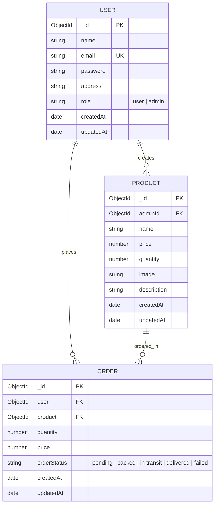
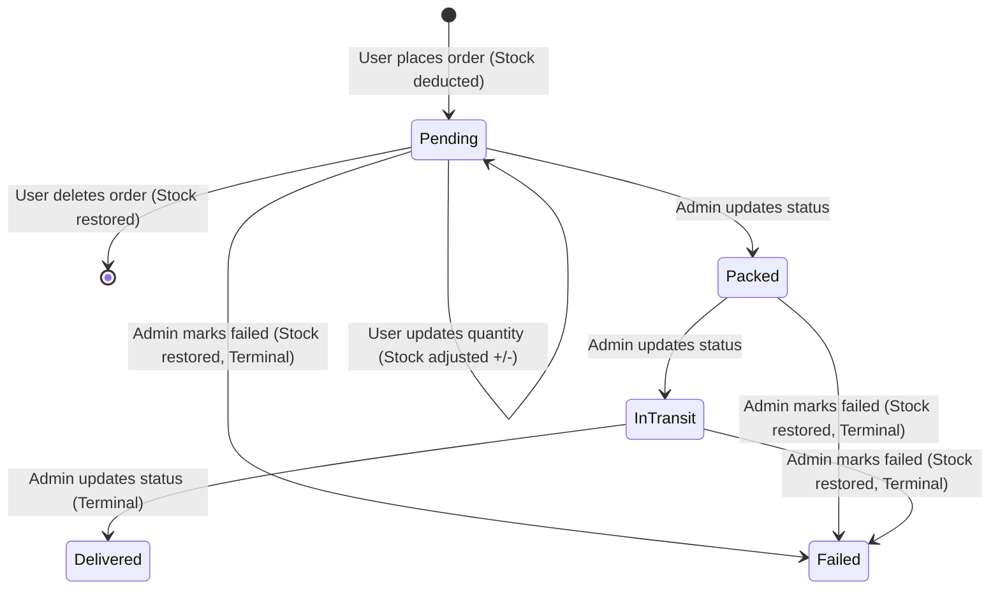

# MqLbRprl - Distributed Systems E-Commerce Backend

[](https://nodejs.org/)
[](https://expressjs.com/)
[](https://mongoosejs.com/)
[](#)

A modular, production-ready RESTful backend built with **Node.js**, **Express 5**, and **MongoDB (Mongoose)**. 

### Why the name `mq_lb_rprl`?
The name stands for the four pillars of scalable distributed systems that this repository is designed to integrate and demonstrate:
- **MQ** &mdash; **M**essage **Q**ueuing (Asynchronous order & notification processing)
- **LB** &mdash; **L**oad **B**alancing (Traffic distribution across cluster replicas)
- **RP** &mdash; **R**everse **P**roxy (SSL termination, caching, and gateway routing)
- **RL** &mdash; **R**ate **L**imiting (DDoS protection and fair resource usage)

While currently functioning as a complete e-commerce backend (Authentication, Product Catalog, Inventory Management, and Order Lifecycles), its architecture is structured to easily attach these infrastructure layers.

---

## Table of Contents
- [Tech Stack](#tech-stack)
- [Project Architecture](#project-architecture)
- [Getting Started](#getting-started)
  - [Prerequisites](#prerequisites)
  - [Installation](#installation)
  - [Environment Variables](#environment-variables)
  - [Running the Server](#running-the-server)
- [Authentication & Authorization](#authentication--authorization)
- [API Reference](#api-reference)
  - [Route Summary](#route-summary)
  - [Authentication Endpoints](#authentication-endpoints)
  - [Product Endpoints](#product-endpoints)
  - [Order Endpoints](#order-endpoints)
- [Data Models & Schema](#data-models--schema)
- [Order Lifecycle & Inventory State Machine](#order-lifecycle--inventory-state-machine)
- [Error Handling Standards](#error-handling-standards)
- [Scalability Roadmap (MQ, LB, RP, RL)](#scalability-roadmap-mq-lb-rp-rl)

---

## Tech Stack

| Layer | Technology | Description |
|---|---|---|
| **Runtime** | Node.js (v18+) | Non-blocking, event-driven JavaScript engine |
| **Framework** | Express 5.x | Web framework with native async error handling |
| **Database** | MongoDB & Mongoose 9 | Document database with strict schema modeling |
| **Authentication** | JWT & bcryptjs | Stateless token auth & secure salt hashing |
| **Validation** | Joi & Mongoose Validators | Payload validation & schema type checks |

---

## Project Architecture

```
mq_lb_rprl/
├── controllers/          # HTTP request handlers & response orchestration
│   ├── authController.js
│   ├── orderController.js
│   └── productController.js
├── db/                   # Database connection configuration
│   └── connectDb.js
├── error_handlers/       # Custom OOP error hierarchy (400, 401, 403, 404, 500)
│   ├── BadRequestError.js
│   ├── CustomApiError.js
│   ├── ForbiddenError.js
│   ├── NotFoundError.js
│   └── UnAuthenticatedError.js
├── middlewares/          # Express middleware pipeline
│   ├── authentication.js
│   ├── errorhandler_middleware.js
│   └── not_found.js
├── models/               # Mongoose schemas with lifecycle hooks & validation
│   ├── order.js
│   ├── product.js
│   └── user.js
├── routes/               # API route definitions
│   ├── authRoute.js
│   ├── orderRoute.js
│   └── productRoute.js
├── services/             # Core business logic & database interactions
│   ├── authService.js
│   ├── orderService.js
│   └── productService.js
├── app.js                # Application entry point & server bootstrap
├── package.json
└── README.md
```

---

## Getting Started

### Prerequisites
- [Node.js](https://nodejs.org/) (v18 or higher recommended)
- [MongoDB Atlas](https://www.mongodb.com/cloud/atlas) or local MongoDB instance

### Installation
1. Clone the repository:
   ```bash
   git clone https://github.com/Amogh-0201/MqLbRprl.git
   cd MqLbRprl
   ```
2. Install dependencies:
   ```bash
   npm install
   ```

### Environment Variables
Create a `.env` file in the root directory:
```env
PORT=3000
MONGO_URI=mongodb+srv://<username>:<password>@cluster.mongodb.net/mq_lb_rprl?retryWrites=true&w=majority
JWT_SECRET=your_super_secret_jwt_key_here
```

### Running the Server
- **Development mode (with auto-restart via Nodemon)**:
  ```bash
  npm run dev
  ```
- **Production mode**:
  ```bash
  npm start
  ```

---

## Authentication & Authorization

All protected routes require an **HTTP Bearer Token** in the request headers:
```http
Authorization: Bearer <your_jwt_token>
```

### Roles
- **`user`**: Can browse products, view product details, place orders, update quantities on pending orders, view their own order history, and cancel pending orders.
- **`admin`**: Can create new products, update/delete products they created, view orders placed for their products, and transition order statuses (`pending` &rarr; `packed` &rarr; `in transit` &rarr; `delivered` or `failed`).

---

## API Reference

### Route Summary

| Method | Endpoint | Auth | Role | Description |
|---|---|---|---|---|
| `POST` | `/api/v1/auth/register` | No | Public | Register a new user or admin |
| `POST` | `/api/v1/auth/login` | No | Public | Authenticate and obtain JWT token |
| `GET` | `/api/v1/auth/me` | Yes | Any | Retrieve authenticated profile |
| `GET` | `/api/v1/products` | No | Public | List all available products |
| `GET` | `/api/v1/products/:productId` | No | Public | Get single product details |
| `POST` | `/api/v1/products` | Yes | `admin` | Create a new product |
| `PATCH` | `/api/v1/products/:productId` | Yes | `admin` (Owner) | Update existing product details |
| `DELETE` | `/api/v1/products/:productId` | Yes | `admin` (Owner) | Delete a product (if no active orders) |
| `POST` | `/api/v1/orders` | Yes | `user` | Place a new order & deduct stock |
| `GET` | `/api/v1/orders` | Yes | `user` / `admin` | Fetch user's orders or admin's product orders |
| `GET` | `/api/v1/orders/:orderId` | Yes | `user` (Owner) / `admin` | Get detailed order by ID |
| `PATCH` | `/api/v1/orders/:orderId/quantity` | Yes | `user` (Owner) | Update pending order quantity |
| `PATCH` | `/api/v1/orders/:orderId/status` | Yes | `admin` (Owner) | Update order status |
| `DELETE` | `/api/v1/orders/:orderId` | Yes | `user` (Owner) | Cancel pending order & restore stock |

---

### Authentication Endpoints

#### 1. Register User / Admin
- **Endpoint**: `POST /api/v1/auth/register`
- **Auth**: Public
- **Request Body**:
  ```json
  {
    "name": "Jane Doe",
    "email": "jane@example.com",
    "password": "securepassword123",
    "address": "123 Main Street, Metropolis",
    "role": "user"
  }
  ```
  *(Note: `role` is optional and defaults to `"user"`. Pass `"admin"` to register an administrator).*
- **Success Response** (`201 Created`):
  ```json
  {
    "token": "eyJhbGciOiJIUzI1NiIsInR5cCI6IkpXVCJ9..."
  }
  ```
- **Error Responses**:
  - `400 Bad Request`: Missing required fields or email already in use.

---

#### 2. User Login
- **Endpoint**: `POST /api/v1/auth/login`
- **Auth**: Public
- **Request Body**:
  ```json
  {
    "email": "jane@example.com",
    "password": "securepassword123"
  }
  ```
- **Success Response** (`200 OK`):
  ```json
  {
    "token": "eyJhbGciOiJIUzI1NiIsInR5cCI6IkpXVCJ9..."
  }
  ```
- **Error Responses**:
  - `400 Bad Request`: Missing credentials.
  - `401 Unauthorized`: Invalid email or password.

---

#### 3. Get Current User Profile
- **Endpoint**: `GET /api/v1/auth/me`
- **Auth**: Bearer Token
- **Success Response** (`200 OK`):
  ```json
  {
    "user": {
      "_id": "65e63892a0e4c6b8c9d1a101",
      "name": "Jane Doe",
      "email": "jane@example.com",
      "address": "123 Main Street, Metropolis",
      "role": "user",
      "createdAt": "2026-03-04T12:00:00.000Z",
      "updatedAt": "2026-03-04T12:00:00.000Z",
      "__v": 0
    }
  }
  ```
  *(Password hash is automatically omitted from the response).*

---

### Product Endpoints

#### 1. List All Products
- **Endpoint**: `GET /api/v1/products`
- **Auth**: Public
- **Success Response** (`200 OK`):
  ```json
  {
    "count": 2,
    "products": [
      {
        "_id": "65e63914a0e4c6b8c9d1a105",
        "adminId": "65e63892a0e4c6b8c9d1a100",
        "name": "Mechanical Keyboard",
        "price": 89.99,
        "quantity": 25,
        "image": "https://example.com/images/keyboard.png",
        "description": "RGB mechanical keyboard with red switches",
        "createdAt": "2026-03-04T12:05:00.000Z",
        "updatedAt": "2026-03-04T12:05:00.000Z"
      }
    ]
  }
  ```

---

#### 2. Get Single Product
- **Endpoint**: `GET /api/v1/products/:productId`
- **Auth**: Public
- **URL Parameters**:
  - `productId` (string, required): 24-character hexadecimal MongoDB ObjectId
- **Success Response** (`200 OK`):
  ```json
  {
    "product": {
      "_id": "65e63914a0e4c6b8c9d1a105",
      "adminId": "65e63892a0e4c6b8c9d1a100",
      "name": "Mechanical Keyboard",
      "price": 89.99,
      "quantity": 25,
      "image": "https://example.com/images/keyboard.png",
      "description": "RGB mechanical keyboard with red switches",
      "createdAt": "2026-03-04T12:05:00.000Z",
      "updatedAt": "2026-03-04T12:05:00.000Z"
    }
  }
  ```
- **Error Responses**:
  - `400 Bad Request`: Invalid ObjectId format.
  - `404 Not Found`: Product does not exist.

---

#### 3. Create Product
- **Endpoint**: `POST /api/v1/products`
- **Auth**: Bearer Token (`admin` only)
- **Request Body**:
  ```json
  {
    "name": "Wireless Mouse",
    "price": 49.99,
    "quantity": 50,
    "image": "https://example.com/images/mouse.png",
    "description": "Ergonomic 2.4GHz wireless mouse"
  }
  ```
- **Validation Rules**:
  - `name`: String, 3 to 100 characters (Required)
  - `price`: Number, greater than 0 (Required)
  - `quantity`: Non-negative integer &ge; 0 (Required)
  - `image`: String (Optional)
  - `description`: String (Optional)
- **Success Response** (`201 Created`):
  ```json
  {
    "msg": "Product created successfully",
    "product": {
      "_id": "65e63980a0e4c6b8c9d1a110",
      "adminId": "65e63892a0e4c6b8c9d1a100",
      "name": "Wireless Mouse",
      "price": 49.99,
      "quantity": 50,
      "image": "https://example.com/images/mouse.png",
      "description": "Ergonomic 2.4GHz wireless mouse",
      "createdAt": "2026-03-04T12:10:00.000Z",
      "updatedAt": "2026-03-04T12:10:00.000Z"
    }
  }
  ```
- **Error Responses**:
  - `401 Unauthorized`: Token missing or invalid.
  - `403 Forbidden`: Authenticated user is not an admin.

---

#### 4. Update Product
- **Endpoint**: `PATCH /api/v1/products/:productId`
- **Auth**: Bearer Token (`admin` who created the product)
- **URL Parameters**:
  - `productId` (string, required): 24-character hexadecimal MongoDB ObjectId
- **Request Body** (at least one field required):
  ```json
  {
    "price": 44.99,
    "quantity": 75
  }
  ```
- **Success Response** (`200 OK`):
  ```json
  {
    "msg": "Product updated successfully",
    "updatedProduct": {
      "_id": "65e63980a0e4c6b8c9d1a110",
      "name": "Wireless Mouse",
      "price": 44.99,
      "quantity": 75,
      "image": "https://example.com/images/mouse.png",
      "description": "Ergonomic 2.4GHz wireless mouse",
      "updatedAt": "2026-03-04T12:15:00.000Z"
    }
  }
  ```
- **Error Responses**:
  - `400 Bad Request`: Validation failure on payload.
  - `403 Forbidden`: Calling admin is not the creator of this product.
  - `404 Not Found`: Product ID not found.

---

#### 5. Delete Product
- **Endpoint**: `DELETE /api/v1/products/:productId`
- **Auth**: Bearer Token (`admin` who created the product)
- **URL Parameters**:
  - `productId` (string, required): 24-character hexadecimal MongoDB ObjectId
- **Success Response** (`200 OK`):
  ```json
  {
    "msg": "Product deleted successfully"
  }
  ```
- **Error Responses**:
  - `400 Bad Request`: Cannot delete product with active pending/in-transit orders.
  - `403 Forbidden`: Calling admin is not the creator of this product.
  - `404 Not Found`: Product ID not found.

---

### Order Endpoints

#### 1. Place an Order
- **Endpoint**: `POST /api/v1/orders`
- **Auth**: Bearer Token (`user` only)
- **Request Body**:
  ```json
  {
    "productId": "65e63980a0e4c6b8c9d1a110",
    "quantity": 2
  }
  ```
- **Validation Rules**:
  - `productId`: Valid MongoDB ObjectId (Required)
  - `quantity`: Positive integer &ge; 1 (Required)
- **Success Response** (`201 Created`):
  ```json
  {
    "msg": "Order placed successfully",
    "order": {
      "_id": "65e63a12a0e4c6b8c9d1a120",
      "user": "65e63892a0e4c6b8c9d1a101",
      "product": {
        "_id": "65e63980a0e4c6b8c9d1a110",
        "name": "Wireless Mouse",
        "price": 44.99,
        "image": "https://example.com/images/mouse.png",
        "description": "Ergonomic 2.4GHz wireless mouse"
      },
      "quantity": 2,
      "price": 89.98,
      "orderStatus": "pending",
      "createdAt": "2026-03-04T12:20:00.000Z",
      "updatedAt": "2026-03-04T12:20:00.000Z"
    }
  }
  ```
- **Error Responses**:
  - `400 Bad Request`: Insufficient stock or invalid quantity format.
  - `403 Forbidden`: Admin/seller role attempting to place orders.
  - `404 Not Found`: Product not found.

---

#### 2. Get All Orders
- **Endpoint**: `GET /api/v1/orders`
- **Auth**: Bearer Token
  - When called by a **`user`**: Returns all orders placed by that user.
  - When called by an **`admin`**: Returns all orders placed for products managed by that admin (with customer information populated).
- **Success Response** (`200 OK`):
  ```json
  {
    "count": 1,
    "orders": [
      {
        "_id": "65e63a12a0e4c6b8c9d1a120",
        "user": {
          "_id": "65e63892a0e4c6b8c9d1a101",
          "name": "Jane Doe",
          "email": "jane@example.com",
          "address": "123 Main Street"
        },
        "product": {
          "_id": "65e63980a0e4c6b8c9d1a110",
          "name": "Wireless Mouse",
          "price": 44.99,
          "image": "https://example.com/images/mouse.png",
          "description": "Ergonomic 2.4GHz wireless mouse"
        },
        "quantity": 2,
        "price": 89.98,
        "orderStatus": "pending",
        "createdAt": "2026-03-04T12:20:00.000Z"
      }
    ]
  }
  ```

---

#### 3. Get Order by ID
- **Endpoint**: `GET /api/v1/orders/:orderId`
- **Auth**: Bearer Token (`user` owner or `admin` owning product)
- **URL Parameters**:
  - `orderId` (string, required): 24-character hexadecimal MongoDB ObjectId
- **Success Response** (`200 OK`):
  ```json
  {
    "order": {
      "_id": "65e63a12a0e4c6b8c9d1a120",
      "user": "65e63892a0e4c6b8c9d1a101",
      "product": {
        "_id": "65e63980a0e4c6b8c9d1a110",
        "name": "Wireless Mouse",
        "price": 44.99,
        "image": "https://example.com/images/mouse.png",
        "description": "Ergonomic 2.4GHz wireless mouse"
      },
      "quantity": 2,
      "price": 89.98,
      "orderStatus": "pending",
      "createdAt": "2026-03-04T12:20:00.000Z"
    }
  }
  ```
- **Error Responses**:
  - `403 Forbidden`: Calling user/admin does not own or manage this order.
  - `404 Not Found`: Order ID not found.

---

#### 4. Update Order Quantity
- **Endpoint**: `PATCH /api/v1/orders/:orderId/quantity`
- **Auth**: Bearer Token (`user` who placed the order)
- **URL Parameters**:
  - `orderId` (string, required): 24-character hexadecimal MongoDB ObjectId
- **Request Body**:
  ```json
  {
    "quantity": 4
  }
  ```
- **Rules**:
  - Can only be updated if `orderStatus` is `"pending"`.
  - Product stock is automatically adjusted by the difference: if quantity increases, remaining stock is decremented; if decreased, excess stock is returned.
- **Success Response** (`200 OK`):
  ```json
  {
    "msg": "Order quantity updated successfully",
    "order": {
      "_id": "65e63a12a0e4c6b8c9d1a120",
      "quantity": 4,
      "price": 179.96,
      "orderStatus": "pending"
    }
  }
  ```
- **Error Responses**:
  - `400 Bad Request`: Order is not in "pending" status, or insufficient inventory.
  - `403 Forbidden`: Calling user does not own the order.

---

#### 5. Update Order Status
- **Endpoint**: `PATCH /api/v1/orders/:orderId/status`
- **Auth**: Bearer Token (`admin` who owns the product)
- **URL Parameters**:
  - `orderId` (string, required): 24-character hexadecimal MongoDB ObjectId
- **Request Body**:
  ```json
  {
    "orderStatus": "packed"
  }
  ```
  *(Allowed values: `"pending"`, `"packed"`, `"in transit"`, `"delivered"`, `"failed"`)*
- **Rules**:
  - Once an order is `"delivered"` or `"failed"`, it cannot be updated.
  - If status is changed to `"failed"`, the reserved inventory quantity is automatically returned to the product stock.
- **Success Response** (`200 OK`):
  ```json
  {
    "msg": "Order status updated successfully",
    "order": {
      "_id": "65e63a12a0e4c6b8c9d1a120",
      "orderStatus": "packed",
      "updatedAt": "2026-03-04T12:30:00.000Z"
    }
  }
  ```
- **Error Responses**:
  - `400 Bad Request`: Invalid status transition or order already finalized.
  - `403 Forbidden`: Admin does not own the ordered product.

---

#### 6. Cancel / Delete Order
- **Endpoint**: `DELETE /api/v1/orders/:orderId`
- **Auth**: Bearer Token (`user` who placed the order)
- **URL Parameters**:
  - `orderId` (string, required): 24-character hexadecimal MongoDB ObjectId
- **Rules**:
  - Can only be deleted if `orderStatus` is `"pending"`.
  - The reserved product quantity is automatically replenished in inventory.
- **Success Response** (`200 OK`):
  ```json
  {
    "msg": "Order deleted successfully"
  }
  ```
- **Error Responses**:
  - `400 Bad Request`: Order is already packed, shipped, or delivered.
  - `403 Forbidden`: Not the order owner.
  - `404 Not Found`: Order ID not found.

---

## Data Models & Schema



---

## Order Lifecycle & Inventory State Machine



---

## Error Handling Standards

All errors conform to predictable, structured JSON responses:

```json
{
  "error": "Descriptive error message"
}
```

| HTTP Code | Error Class | Typical Trigger |
|---|---|---|
| `400` | `BadRequestError` | Validation error, negative price/qty, insufficient stock, duplicate key |
| `401` | `UnAuthenticatedError` | Missing Bearer token, expired token, incorrect credentials |
| `403` | `ForbiddenError` | Role restriction (e.g. non-admin creating product), unauthorized resource edit |
| `404` | `NotFoundError` | Product or Order ID does not exist in the database |
| `500` | Internal Server Error | Unexpected database or server crash |

---

## Scalability Roadmap (MQ, LB, RP, RL)

This backend serves as the foundation for testing and integrating key distributed systems components:

### 1. 📬 Message Queuing (MQ)
*Target: RabbitMQ / Apache Kafka / Redis Streams*
- **Problem**: Synchronous order placement couples inventory check, database write, payment confirmation, and notification delivery in a single HTTP request. Under heavy load (e.g., flash sales), this leads to connection exhaustion.
- **Solution**:
  - When `POST /api/v1/orders` is received, push an `OrderCreatedEvent` to a message queue and return `202 Accepted` immediately.
  - Dedicated consumer worker processes handle atomic inventory deduction, payment capture, and notification delivery asynchronously.

### 2. ⚖️ Load Balancing (LB)
*Target: Nginx / HAProxy / AWS ALB*
- **Problem**: A single Node.js instance runs on a single thread and cannot saturate multi-core CPUs.
- **Solution**:
  - Run multiple Node.js server instances across distinct ports (e.g., `3001`, `3002`, `3003`).
  - Configure a load balancer with **Round-Robin** or **Least Connections** algorithms with periodic health checks (`GET /health`).

### 3. 🛡️ Reverse Proxy (RP)
*Target: Nginx / Cloudflare / Envoy*
- **Problem**: Exposing the application server directly risks DDOS attacks, lacks response caching for hot endpoints, and complicates SSL management.
- **Solution**:
  - Deploy a reverse proxy in front of the Node.js application to handle SSL/TLS termination, gzip/brotli compression, and caching for `GET /api/v1/products`.

### 4. ⏱️ Rate Limiting (RL)
*Target: Redis + Express Rate Limit / Token Bucket Algorithm*
- **Problem**: Malicious actors or crawlers can spam `/api/v1/auth/login` (brute-force) or rapidly deplete inventory via bot orders.
- **Solution**:
  - Implement a **Sliding Window** or **Token Bucket** algorithm backed by Redis.
  - Strict limits on Auth endpoints (e.g., 10 requests per 15 minutes per IP) and Orders (e.g., 5 orders per minute per user).